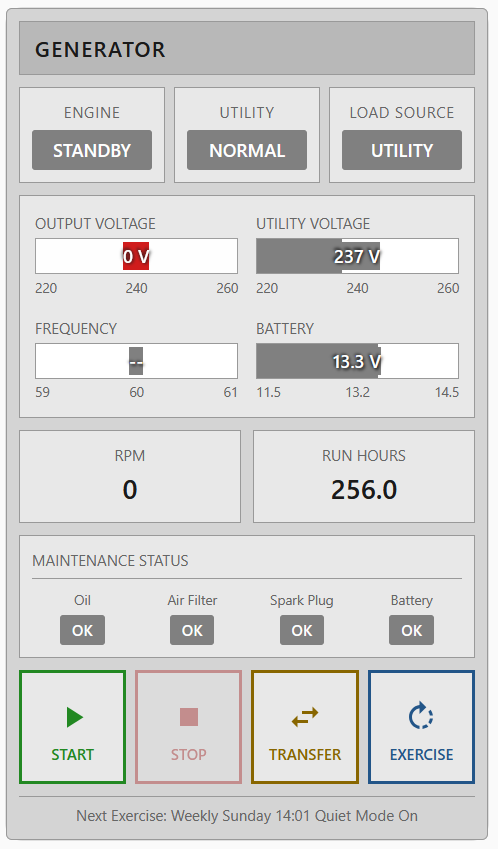

# Generator HMI Card

ISA-101 compliant Human Machine Interface (HMI) card for Home Assistant, designed for Genmon generator monitoring systems.



## Features

- **ISA-101 High Performance Design**: Industrial gray theme following HMI standards
- **Status Indicators**: Engine state, utility power, transfer switch with color-coded states
- **Analog Bar Displays**: Output voltage, utility voltage, frequency, battery with visual scales
- **Engine Metrics**: RPM, run hours
- **Maintenance Status**: Oil, air filter, spark plug, battery service with smart parsing
- **Control Buttons**: Start, Stop, Transfer, Exercise with confirmation dialogs
- **Smart Button States**: Buttons enable/disable based on running state
- **Alarm Indicators**: Flashing alerts for alarm conditions

## Installation

### HACS (Recommended)
1. Open HACS in Home Assistant
2. Go to "Frontend" section
3. Click the menu (three dots) and select "Custom repositories"
4. Add `https://github.com/jtubb/generator-hmi-card` with category "Lovelace"
5. Install "Generator HMI Card"
6. Add the resource (see below)

### Manual
1. Copy `generator-hmi-card.js` to `/config/www/generator-hmi-card/`
2. Add the resource to your Lovelace configuration

## Configuration

### Add Resource

Add to your Lovelace resources:

```yaml
resources:
  - url: /local/generator-hmi-card/generator-hmi-card.js?v=2.2.0
    type: module
```

Or via UI: Settings → Dashboards → Resources → Add Resource

### Card Configuration

```yaml
type: custom:generator-hmi-card
title: GENERATOR
device_name: generator
show_controls: true
show_maintenance: true
```

### Options

| Option | Type | Default | Description |
|--------|------|---------|-------------|
| `title` | string | `GENERATOR` | Header title |
| `device_name` | string | `generator` | Device name as configured in Genmon (used to build entity IDs) |
| `entity_prefix` | string | auto | Override sensor entity prefix (e.g., `sensor.my_gen_`) |
| `button_prefix` | string | auto | Override button entity prefix (e.g., `button.my_gen_`) |
| `show_controls` | boolean | `true` | Show control buttons |
| `show_maintenance` | boolean | `true` | Show maintenance status |
| `voltage_nominal` | number | `240` | Nominal voltage for bar display |
| `voltage_min` | number | `220` | Minimum voltage for bar display |
| `voltage_max` | number | `260` | Maximum voltage for bar display |
| `frequency_nominal` | number | `60` | Nominal frequency |
| `frequency_min` | number | `59` | Minimum frequency |
| `frequency_max` | number | `61` | Maximum frequency |
| `battery_nominal` | number | `13.2` | Nominal battery voltage |
| `battery_min` | number | `11.5` | Minimum battery voltage |
| `battery_max` | number | `14.5` | Maximum battery voltage |

### Device Name Examples

The `device_name` option automatically builds entity prefixes:

| device_name | Sensor Prefix | Button Prefix |
|-------------|---------------|---------------|
| `generator` | `sensor.generator_` | `button.generator_` |
| `Generator` | `sensor.generator_` | `button.generator_` |
| `My Gen` | `sensor.my_gen_` | `button.my_gen_` |
| `backup_power` | `sensor.backup_power_` | `button.backup_power_` |

## Required Entities

This card expects entities from the Genmon Home Assistant integration. With `device_name: generator`, it looks for:

### Sensors
- `sensor.generator_engine_state` - Engine running state
- `sensor.generator_outage_status` - Utility outage status
- `sensor.generator_switch_state` - Transfer switch position
- `sensor.generator_output_voltage` - Generator output voltage
- `sensor.generator_utility_voltage` - Utility input voltage
- `sensor.generator_frequency` - Output frequency
- `sensor.generator_rpm` - Engine RPM
- `sensor.generator_battery_voltage` - Starter battery voltage
- `sensor.generator_total_run_hours` - Total run hours
- `sensor.generator_oil_and_filter_service_due` - Oil service status
- `sensor.generator_air_filter_service_due` - Air filter service status
- `sensor.generator_spark_plug_service_due` - Spark plug service status
- `sensor.generator_battery_check_due` - Battery check status
- `sensor.generator_exercise_time` - Next scheduled exercise

### Buttons
- `button.generator_start` - Manual start
- `button.generator_stop` - Manual stop
- `button.generator_start_transfer` - Start and transfer load
- `button.generator_start_exercise` - Run exercise cycle

## ISA-101 Color Coding

This card follows ISA-101 HMI color standards:

| Color | Level | Meaning |
|-------|-------|---------|
| Gray | 0 | Normal/Standby |
| Blue | 1 | Abnormal (running, active) |
| Amber | 2 | Warning (attention needed) |
| Red | 3 | Alarm (action required) |

## Maintenance Status Logic

The card parses Genmon's maintenance format (`X hrs or MM/DD/YYYY`):

| Hours Remaining | Status | Color |
|-----------------|--------|-------|
| >50 hrs | OK | Gray |
| 21-50 hrs | Xh | Blue |
| 1-20 hrs | Xh | Amber |
| ≤0 hrs | OVERDUE | Red |

## License

MIT License - See [LICENSE](LICENSE) file for details.

## Credits

- Designed for use with [Genmon](https://github.com/jgyates/genmon)
- ISA-101 styling based on High Performance HMI principles
